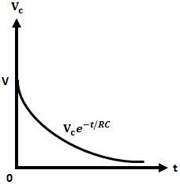

<head>

</head>

### Introduction

The Loss of Charge Method is used to measure resistance greater than 100KΩ or 0.1MΩ. The drawback of the Wheatstone bridge is that it cannot be used to measure the high value of resistance of the order of 1MΩ because of the reduction in the sensitivity to unbalance caused by the high resistance values. Also, the high resistance measurements are inaccurate due to leakage over the insulation of the bridge arms. 

  

**Fig. 1 Loss of Charge Method**

Hence, In order to avoid the above problems while doing high resistance measurement the following methods are used: 

<ul>
<li>Loss of Charge Method</li>
<li>Direct Deflection Method</li>
<li>Megohm bridge Method</li>
<li>Megger</li>
</ul>

The basic idea is based on the charging and discharging of a known value capacitor. The figure 1 above shows the circuit connections for the loss of charge method. Where, R is the unknown resistance to be measured, C is a known value capacitor placed across R, V is a voltmeter to measure the voltage across the parallel combination of R and C.

The circuit is driven by a battery having a voltage(V). S1 and S2 are the switches used for charging and discharging the capacitor. It is assumed that the internal resistance of the voltmeter and leakage resistance of the capacitor is infinite. The sequence of operation can be explained as follows: 

### When Switch S1 Closed and S2 Open:
With switch S1 closed and S2 open, the capacitor charges to a particular voltage. The voltage across C is measured by the voltmeter V and is noted down. 

### When Switch S1 Open and S2 Closed:
With switch S1 open and S2 closed, the battery is disconnected and the unknown resistance R gets connected across C. Now, the capacitor discharges through R. During this, the capacitor voltage is measured by the voltmeter. 

Taking the above two readings of voltmeter, we get two equations solving the two equations, the value of unknown resistance can be determined.

### Derivation:

If Vc be the terminal voltage of the capacitor consisting of capacitance C farad (assumed to be lossless) and Q (coulomb) be the charge at time t (secs). Then, the charging current i is, 

$$i = -\frac{dQ}{dt} = -\frac{d(CV_c)}{dt} = -C\frac{dV_c}{dt}..... (1)$$

$$i = \frac{V_c}{R}....... (2)$$

Equating equations 1 and 2, we get, 

$$\frac{V_c}{R} = -C\frac{dV_c}{dt}$$

$$\frac{dV_c}{V_c} = -\frac{1}{CR}dt$$

Applying integration on both sides, We get,

$$lnV_c = -\frac{1}{CR} + lnA$$

Where, A = Arbitrary&nbsp;Constant

Applying initial conditions to the above equation. At t = 0, Vc = V i.e., the voltage at which capacitor is initially charged, therefore,  

$$A = V$$

$$lnV_c = lnV - \frac{1}{CR}$$

$$\frac{1}{CR} = ln\left (\frac{V}{Vc}\right )$$

$$R = \frac{1}{Cln\left (\frac{V}{V_c}\right )} = \frac{0.434t}{Clog\left (\frac{V}{V_c}\right )}$$

The below graph shows the variation of Vc with respect to t. If the value of the resistance to be measured is very large, then the time taken for the voltage to fall is quite large. 

  

**Fig. 2 Variation of VC with respect to t**

### Applications of Loss of Charge Method:

This method is used for the measurement of the very high value of resistance as follows: 

1. The insulation resistance of Cables and Machines. 

2. Leakage resistance of the capacitor. 

3. High resistance circuits like vacuum tubes and surface resistivity of the material.

4. Insulation resistance of the transformer windings.

